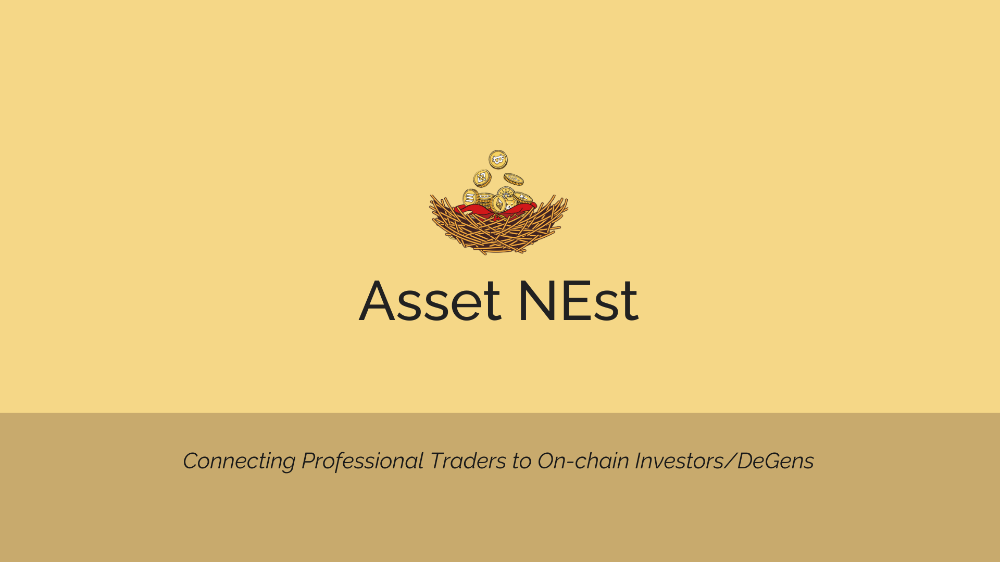
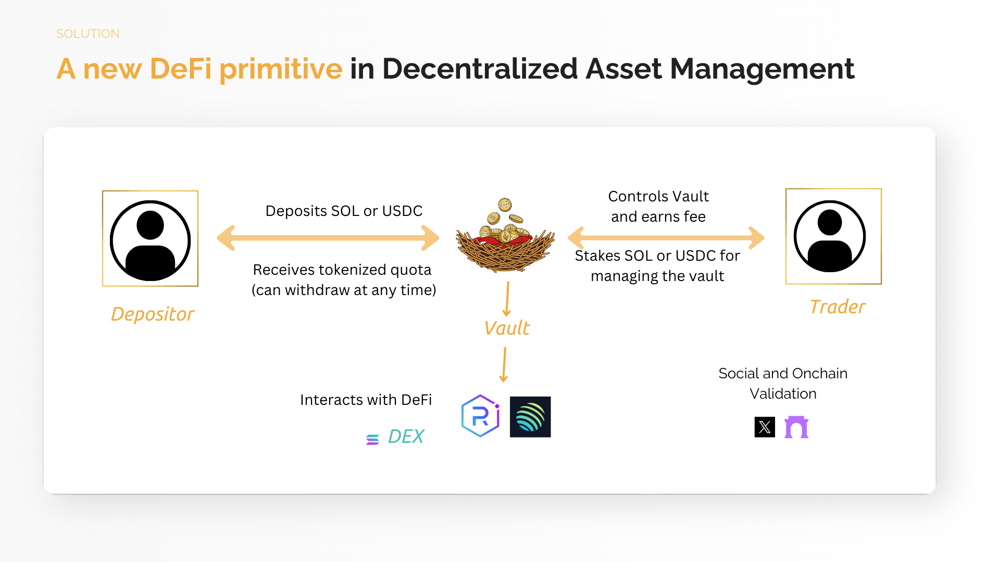

# AssetNest

## Decentralised Asset Manager - connect and earn along with professional traders in the space

*In Progess

## Overall Project Introduction
- *Project Background:*

   > "The idea is came from the need of fund managers in crypto with adequate security and trust. In traditional markets, we don't have transparency in the management of funds, using blockchain technology we can put transparency and security to both parties"

- *Project Introduction:*

  - Asset NEst allow managers to hold assets from investors priorizing *security*. In this way, we can basically make a descentralized asset management. 
  
  - The platform is designed for the two publics: The depositors, who will be able to deposit their tokens in really great vaults managed by experts in a safe way, and the traders, who will be able to manage and hold depositor tokens and can have a profit to themselves.

- *Why Solana?*

  - *High Transaction Throughput* 

  - *Fast Transaction Confirmation Times* 

  - *Low Gas Fee Transaction Cost* 

- *Programs:*

  CQazXyCtxKTQrm85Z9c2FJjRYEVJmzhwwNNToRsBYKCZ (deployed in Devnet)

- *Project Demo*

   [App Link]()

- *Project Logo:* 

_

## Current Systems 

### Traditional

- Financial terms
  - Distributor: Markets and sells financial products to investors.
  
  - Exchange: Platform for buying and selling financial assets.
  
  - Custodian: Safeguards and manages financial assets.
  
  - Fund: Pooled investment vehicle managed professionally.
  

 Flow over a fund invesment in the traditional financial market -

  - *Investor & Fund:* To have a share in the fund, the investor must pay a management fee to the manager, and a performance fee equivalent to a percentage above the market benchmark.
  
  - *Distributor & Fund:* The distributor acts as a bridge between the fund and potential investors, marketing and selling the fund's financial products.

  - *Exchange & Fund:* Exchanges serve as vital platforms where funds can actively participate in trading activities, acquiring or disposing of assets as per their investment strategies.
  
  - *Custodian & Fund:* Custodians play a pivotal role in safeguarding the assets of the fund, ensuring that they are held securely and are not susceptible to theft or loss. Apart from asset safekeeping.

# AssetNEst 
## Workflow

* Project still in progess , working over with Smart contracts on Solana